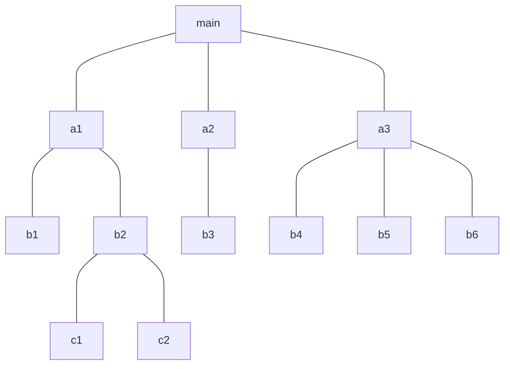

> Иногда имеет смысл строить сеть с использованием нескольких концентраторов, иерархически соединенных между собой звездообразными связями (д). Получаемую в результате структуру называют иерархической звездой, или деревом. В настоящее время дерево является самой распространенной топологией связей как в локальных, так и глобальных сетях.

*Олифер "Компьютерные сети" Глава 2. Общие принципы построения сетей. стр 58*

[[Топологигя сетей]]
[[Звездообразная]]

