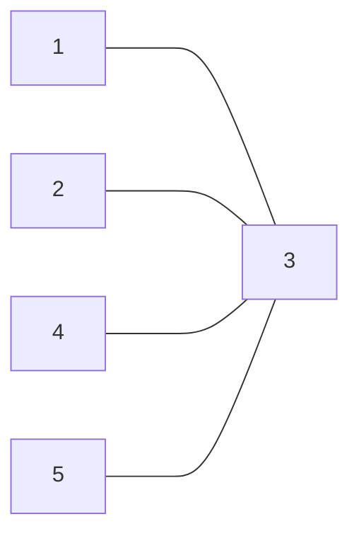

> Звездообразная топология (г) образуется в случае, когда каждый компьютер подключается непосредственно к общему центральному устройству, называемому концентратором2. В функции концентратора входит направление передаваемой компьютером информации одному или всем остальным компьютерам сети. В качестве концентратора может выступать как универсальный компьютер, так и специализированное устройство. К недостаткам звездообразной топологии относится более высокая стоимость сетевого оборудования из-за необходимости приобретения специализированного центрального устройства. Кроме того, возможности по наращиванию количества узлов в сети ограничиваются количеством портов концентратора.

*Олифер "Компьютерные сети" Глава 2. Общие принципы построения сетей. стр 58*

Плюсы | Минусы
-- | --
-| Требуется сильная центральная машина

[[Топологигя сетей]]
[[Кольцевая]]
