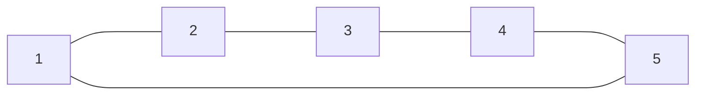

> В сетях с кольцевой топологией (в) данные передаются по кольцу от одного компьютера к другому. Главным достоинством кольца является то, что оно по своей природе обеспечивает резервирование связей. Действительно, любая пара узлов соединена здесь двумя путями — по часовой стрелке и против нее. Кроме того, кольцо представляет собой очень удобную конфигурацию для организации обратной связи — данные, сделав полный оборот, возвращаются к узлу-источнику. Поэтому источник может контролировать процесс доставки данных адресату. Часто это свойство кольца используется для тестирования связности сети и поиска узла, работающего некорректно. В то же время в сетях с кольцевой топологией необходимо принимать специальные меры, чтобы в случае выхода из строя или отключения какого-либо компьютера не прерывался канал связи между остальными узлами кольца.

*Олифер "Компьютерные сети" Глава 2. Общие принципы построения сетей. стр 58*

Плюсы | Минусы
-- | --
Резервирование связей | Низкая надежность
Удобная конфигурация связей | -

[[Топологигя сетей]]
[[Полносвязная]]
