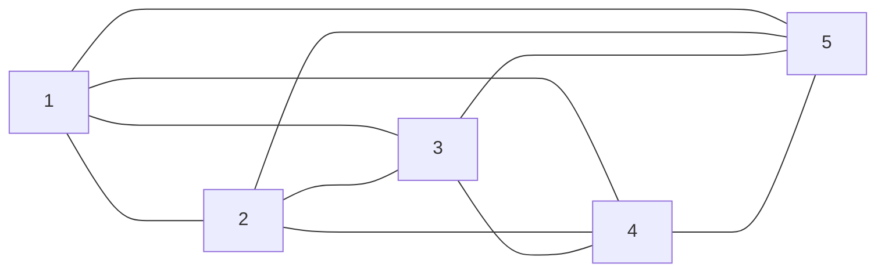

> Полносвязная топология соответствует сети, в которой каждый компьютер непосредственно связан со всеми остальными. Несмотря на логическую простоту, этот вариант оказывается громоздким и неэффективным. Действительно, в таком случае каждый компьютер в сети должен иметь большое количество коммуникационных портов, достаточное для связи с каждым из остальных компьютеров сети. Для каждой пары компьютеров должна быть выделена отдельная физическая линия связи. (В некоторых случаях даже две, если невозможно использование этой линии для двусторонней передачи.)

*Олифер "Компьютерные сети" Глава 2. Общие принципы построения сетей. стр 57*

Плюсы | Минусы
--|--
Тяжело перегрузить сеть | Сложная огранизация
-| Нужно больше ресурсов для функционирования сети
-| Слабая безопасность
-| Малая эффективность

[[Топологигя сетей]]
[[Шина]]

