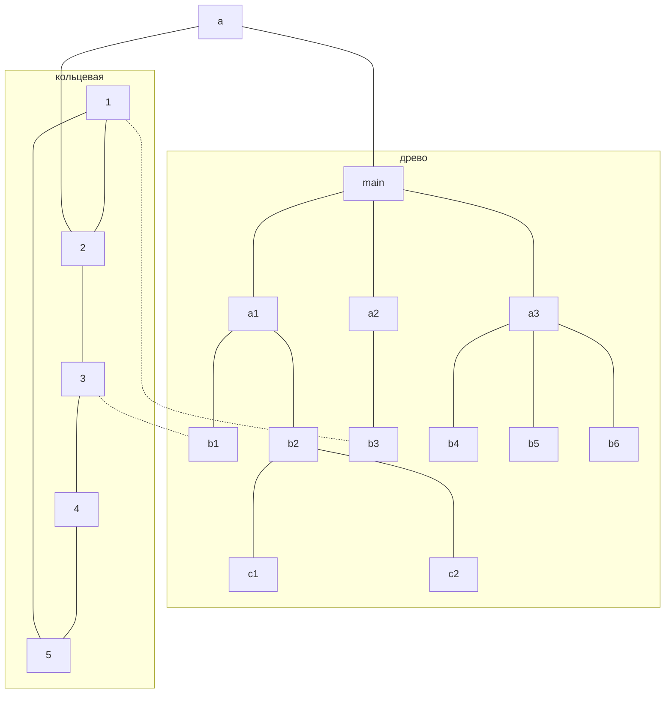

> Исторически главной целью объединения компьютеров в сеть было разделение ресурсов: пользователи компьютеров, подключенных к сети, или приложения, выполняемые на этих компьютерах, получают возможность автоматического доступа к разнообразным ресурсам остальных компьютеров сети.

*Олифер "Компьютерные сети" Глава 2. Общие принципы построения сетей. стр 40*

> Объединяя в сеть несколько (больше двух) компьютеров, необходимо решить, каким образом соединить их друг с другом, другими словами, выбрать конфигурацию физических связей, или топологию.

> Под топологией сети понимается конфигурация графа, вершинам которого соответствуют конечные узлы сети (например, компьютеры) и коммуникационное оборудование (например, маршрутизаторы), а ребрам — физические или информационные связи между вершинами.

*Олифер "Компьютерные сети" Глава 2. Общие принципы построения сетей. стр 56*

> Компьютерные сети предоставляют услуги двух типов: информационные и транспортные. Информационные услуги предоставляются конечными узлами сети — серверами, а транспортные — промежуточными узлами, которыми являются коммутаторы и маршрутизаторы сети.

*Олифер "Компьютерные сети" Глава 4. Архитектура, стандартизация и классификация сетей. стр 137*

[[Полносвязная]]
[[Ячеистая]]
[[Кольцевая]]
[[Звездообразная]]
[[Древо]]
[[Шина]]

> В то время как небольшие сети, как правило, имеют типовую топологию — звезда, кольцо или общая шина, для крупных сетей характерно наличие произвольных связей между компьютерами. В таких сетях можно выделить отдельные произвольно связанные фрагменты (подсети), имеющие типовую топологию, поэтому их называют сетями со смешанной топологией.

*Олифер "Компьютерные сети" Глава 2. Общие принципы построения сетей. стр 58*

