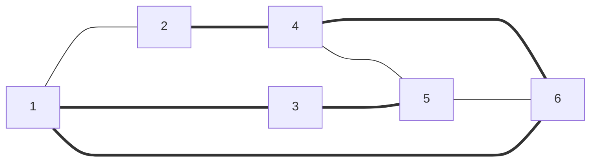

> Ячеистая топология получается из полносвязной путем удаления некоторых связей. Ячеистая топология допускает соединение большого количества компьютеров и характерна, как правило, для крупных сетей.

*Олифер "Компьютерные сети" Глава 2. Общие принципы построения сетей. стр 58*

[[Топологигя сетей]]
