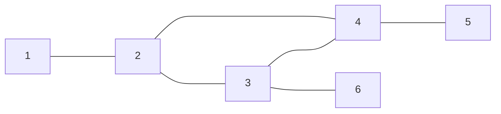

> **Spanning Tree Protocol** (**STP**, протокол остовного дерева — канальный протокол. Основной задачей STP является устранение петель в топологии произвольной сети Ethernet, в которой есть один или более сетевых мостов, связанных избыточными соединениями. STP решает эту задачу, автоматически блокируя соединения, которые в данный момент для полной связности коммутаторов являются избыточными.

> В образовавшемся кольце из машин 2; 3; 4; получается петля, которая может привести к большому количеству повторяющихся сообщений.

_Краткий алгоритм работы протокола STP_
1.  Выбирается один корневой мост.
2.  Далее каждый коммутатор просчитывает кратчайший путь к корневому. Соответствующий порт называется корневым портом. У любого некорневого коммутатора может быть только один корневой порт.
3.  После этого для каждого сегмента сети, к которому присоединён более чем один мост (или несколько портов одного моста), просчитывается кратчайший путь к корневому мосту(порту). Мост, через который проходит этот путь, становится **назначенным** для этой сети, а соответствующий порт — **назначенным портом**.
4.  Далее во всех сегментах, с которыми соединено более одного порта моста, все мосты блокируют все порты, не являющиеся корневыми и назначенными. В итоге получается древовидная структура с вершиной в виде корневого коммутатора.

[[OSI]]